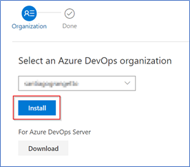
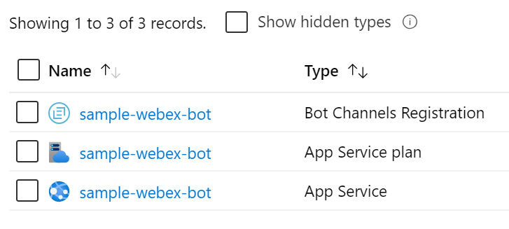

# Bot Deployment Task Dev Spec One-Pager

## Summary

The task wraps [AZ CLI](https://docs.microsoft.com/en-us/cli/azure/?view=azure-cli-latest) deployment commands to deploy a published bot zip file to Azure using the [Azure Resource Manager templates](https://azure.microsoft.com/en-in/documentation/articles/resource-group-template-deploy/), and to connect it with channels as Direct Line, Slack, Twilio, Facebook or Webex.

The task requires a zipped bot project as an input parameter, and does a [zip-deploy](https://github.com/projectkudu/kudu/wiki/Deploying-from-a-zip-file-or-url) to upload and deploy the bot to Azure.

This allows the task to be able to deploy almost any bot*, whether they are .NET or JS, or use cognitive services such as LUIS, as long as they use the proper template and are zipped and prepared as the zip deployment is indicated for the language (see [link](https://docs.microsoft.com/en-us/azure/bot-service/bot-builder-deploy-az-cli?view=azure-bot-service-4.0&tabs=csharp#5-prepare-your-code-for-deployment)).

**the deployment of bots in Python is not functional currently.*

## Requirements

#### Azure Subscription

To deploy to Azure, an Azure subscription has to be linked to Team Foundation Server or to Azure Pipelines using the Services tab in the Account Administration section.

### Prerequisites

- azure-pipelines-task-lib library
- Project bot published in a zip file
- ARM template

### Use Cases

This task is used to deploy a bot to Azure

These are some of the possible use cases:

- Deployment with Validation Mode (no resources will be deployed).
- Deployment with an ARM parameters file.
- Deployment with an ARM parameters file and overriding some parameters.
- Deployment connecting the bot with the Direct Line and MS Teams channels.
- Deployment connecting the bot with the Slack channel.
- Deployment connecting the bot with a Facebook page.
- Deployment connecting the bot with a Twilio number.
- Deployment connecting the bot with a Webex channel.

## Design Specifications

The UI of the task keeps consistency with the Azure Pipeline Tasks style. Also maintains most of their input's names.

### Parameters of the task

The parameters listed with a * are required for the task:

- **Azure Subscription***: The service connection name linked with the Azure Subscription where the resources will be created.

- **Deployment Scope***: The scope for the deployment. It could be a deployment to a *Subscription* level or to a *Resource Group*.

- **Resource Group***: The name for the resource group, either existing or to be created.

- **Location***: The location where the resource group will be created.

- **Template***: Full path or a pattern pointing for the [Azure Resources Manager](https://docs.microsoft.com/en-us/azure/azure-resource-manager/templates/) template file for the project.

- **Template Parameters**: Full path or a pattern pointing for the parameters file for the Azure Resource Manager template.

- **Override Template Parameters**: A grid to override any parameter of the parameters file. The parameters name and value go separated by spaces as follows:

  `-<parameter1> <value1> -<parameter2> <value2> `

- **Validation Mode**: Enables a syntactical validation of the template without creating actual resources.

- **Zipped bot***: Path to the package or folder containing the zipped bot's project in a format compatible with the [kudu zip deployment](https://docs.microsoft.com/en-us/azure/bot-service/bot-builder-deploy-az-cli?view=azure-bot-service-4.0&tabs=csharp#5-prepare-your-code-for-deployment).

- **Connection with Channels**: You can select the channel your bot will connect to.

  - **Direct Line**
  - **Slack**
  - **Teams**
  - **Webex**
  - **Facebook**
  - **Twilio**

  *Note: Slack, Webex, Facebook and Twilio need extra credentials that will be required once the check box is selected.*

## Usage and installation

**Installing**

- Install the task from [Azure DevOps marketplace](https://marketplace.visualstudio.com/items?itemName=Southworks-Pipelines-Test.bot-deployment).

- Select the organization you want to use the task and click on install. 

- Then click **Proceed to organization**.

  

**Running**

- In Azure DevOps go to your pipeline or create a new one.
- Adding a new task, search for **Bot Deployment**.

- Fill in the [parameters](#parameters-of-the-task).
- Run the pipeline. The step will display output in the console at the DevOps job view.
- Once the step ran you should see the indicator of the step having run successfully or not.
- If successful, the bot should be visibly deployed in Azure, and should be responsive when tested for conversation.

## Task workflow

The task internally executes the following flow:

**Login to Azure**: Run *az login* command.

If **Validation Mode = true**

- Run *az deployment validate* command.

If **Validation Mode = false**

- Check **Resource Group existence**: Run *az group exists* command. If it doesn't exist: Run *az group create* command.
- **Resources Deployment**
  - Scope ***Resource Group***: Run *az group deployment create* command.
  - Scope ***Subscription***: Run *az deployment create* command.
- **Bot Deployment**: Run *az webapp deployment source config-zip* command to deploy the zipped bot.
- **Connection with Channels**:
  - Direct Line: Run *az bot directline create* command.
  - MS Teams: Run *az bot msteams create* command.
  - Slack: add the Slack extra parameters to the Resources Deployment step.
  - Webex: add the Webex extra parameters to the Resources Deployment step.
  - Facebook: add the Facebook extra parameters to the Resources Deployment step.
  - Twilio: add the Twilio extra parameters to the Resources Deployment step.

**Finish** execution.

The final result is the bot deployed in Azure, you can check it on [Azure Portal](https://portal.azure.com/) in the resource group you used for the deploy.

## Special Considerations

The connection with the Slack, Twilio, Facebook and Webex channels is made through the [BotFramework SDK Adapters](https://github.com/microsoft/botbuilder-dotnet/tree/master/libraries/Adapters). Therefore, the deployed bot must include the corresponding adapters to connect with these channels.

## Issues

- TODO: Add telemetry to identify the use of the AZ CLI throughout the task.